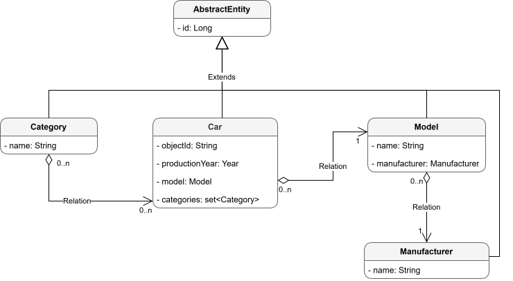

# Car REST Service

## 🎯 Motivation & Goal
The **Car REST Service** was developed with the following motivations:

- **Mastering RESTful APIs**: To deepen expertise in designing and implementing REST APIs using Spring Boot, focusing
on best practices for endpoints, data modeling, and CRUD operations.
- **Training Milestone**: As part of the Foxminded training program, this project serves as a practical step toward
mastering backend development.
- **End-to-End Development**: To understand the full development lifecycle, from database design to API testing and
deployment.

### 🛠️ Technologies Used
- **Core**: *Java 21*
- **Frameworks**: *Spring Boot, Spring MVC, Spring Data JPA*
- **Persistence**: *Hibernate, PostgreSQL, Flyway*
- **Security**: *Auth0*
- **API Documentation**: *OpenApi*
- **Utilities**: *MapStruct, Lombok*
- **Testing**: *JUnit 5, Mockito, Testcontainers*
- **Build & VCS**: *Maven, Git, Docker*

## 📝 Description

### ❓ What is Car REST Service?
Car REST Service is a RESTful API designed to manage car-related data, providing a robust and scalable backend for
storing, retrieving, updating, and deleting car records. The service is built to handle structured data about cars,
their models, manufacturers, and categories, based on a provided dataset (CSV file). It serves as a foundation for
applications requiring car data management, such as automotive catalogs, sales platforms, or inventory systems.
The API follows REST principles, offering endpoints for basic CRUD operations with support for pagination and sorting.
It is designed with clean code practices, leveraging Spring Boot’s ecosystem for rapid development and maintainability.

### 🛡️ What Problems Does It Solve?
The service addresses key challenges in car data management by:

- Providing a centralized API to manage car records, including their relationships with models, manufacturers,
and categories.
- Supporting paginated and sorted responses to handle large datasets efficiently.
- Enabling seamless integration with frontends or other services through a well-defined REST interface.
- Automating database schema management with Flyway for consistent migrations.

### ✨ Features
- **CRUD Operations**: Full support for creating, reading, updating, and deleting car records.
- **Pagination & Sorting**: Efficient handling of large datasets with Spring Data JPA.
- **Data Mapping**: Automated DTO mapping with MapStruct for clean code.
- **Database Management**: Schema migrations with Flyway, supporting both PostgreSQL and H2 databases.
- **Testing**: Comprehensive unit tests for controllers and services using JUnit 5, Mockito, MockMvc and Testcontainers.


## 🚀 Install & Run

### 📋 Prerequisites
- **Git**: For cloning the repository.
- **Java 21**: Required for building and running locally.
- **PostgreSQL**: For the database.
- **Docker**: Required for integration tests with Testcontainers and optional for running PostgreSQL or the application
in a container.


Clone the repository:

```bash
git clone https://gitlab.com/SerhiiBohdan/car-rest-service.git
cd car-rest-service
```

### ▶️ Running the Application

1. **Using Docker Compose**
    - Ensure Docker and Docker Compose are installed.
    - Run the application and PostgreSQL using Docker Compose:
      ```bash
      docker compose up -d
      ```

    - The application will be available at `http://localhost:8082`. The PostgreSQL database runs in a separate
      container, and the application connects to it automatically.
    - To stop the application and database:
      ```bash
      docker compose down
      ```

    - To stop and remove volumes (including database data):
      ```bash
      docker compose down -v
      ```

2. **Using Maven**

    - **Set Up PostgreSQL**
        - **Option 1: Using Local PostgreSQL**
            - Install PostgreSQL and create a database named `car_service`.
            - Update `src/main/resources/application.yml` with your PostgreSQL credentials:
              ```yml
              spring:
                datasource:
                  driver-class-name: org.postgresql.Driver
                  url: jdbc:postgresql://localhost:5432/car_service
                  username: your-username
                  password: your-password
              ```

        - **Option 2: Using Docker with PostgreSQL**
            - Ensure Docker is running.
            - Run PostgreSQL in a Docker container:
              ```bash
              docker run -d --name car-db \
              -e POSTGRES_USER=postgres \
              -e POSTGRES_PASSWORD=pass \
              -e POSTGRES_DB=car_service \
              -p 5432:5432 \
              postgres:16
              ```

            - Update `src/main/resources/application.yml` to match Docker database credentials:
              ```yml
              spring:
                datasource:
                  driver-class-name: org.postgresql.Driver
                  url: jdbc:postgresql://localhost:5432/car_service
                  username: postgres
                  password: pass
              ```

    - **Run with Maven**
        - Install dependencies and start the application:
          ```bash
          # For Windows
          mvnw.cmd install
          mvnw.cmd spring-boot:run
          # For Linux/MacOS
          ./mvnw install
          ./mvnw spring-boot:run
          ```

## 🖱️ How to Use It?

### 🔒 Security
Car REST Service acts as a **resource server** in the [OAuth 2.0 model](https://datatracker.ietf.org/doc/html/rfc6749),
utilizing **Auth0** as the authorization server to secure access to its endpoints. **POST, PATCH, and DELETE requests**
require a **Bearer Access Token** for authentication, which can be obtained by executing the authentication request in
the **Authentication** folder of the provided Postman collection. The token is automatically set in the
**Authorization** header for these requests using a Collection Variable. No specific scopes are required for these
operations. **GET requests** are publicly accessible and do not require authentication.

To customize authentication, users can create their own Auth0 account and register their API:
- **Set Up Auth0**: Create an account on [Auth0](https://auth0.com/). Register a new API in the Auth0 dashboard and
create a **Machine-to-Machine** application to obtain client credentials (Client ID and Client Secret).
- **Configure the Application**: Update `src/main/resources/application.yml` with your Auth0 configuration:
  ```yml
  spring:
    security:
      oauth2:
        resourceserver:
          jwt:
            issuer-uri: https://your-auth0-domain/
            audiences: your-api-audience
  ```
- **Obtain a Token**: Use the client credentials to request an access token from Auth0, as shown in the Postman
collection.

For detailed guidance, refer to these resources:
- [Creating an Auth0 Account](https://youtu.be/ppAaPcoHlW8?si=VGglxG-CK4JJNBmx)
- [Auth0 Quickstart for Spring Boot](https://auth0.com/docs/quickstart/backend/java-spring-security5/01-authorization)
- [Configuring Machine-to-Machine Applications](https://auth0.com/docs/get-started/auth0-overview/create-applications/machine-to-machine-apps)

### 🖱️ Testing with Swagger
The API can be tested using the Swagger UI interface available at [http://localhost:8082/swagger-ui/index.html](http://localhost:8082/swagger-ui/index.html).
The full API specification in JSON format is accessible at [http://localhost:8082/v3/api-docs](http://localhost:8082/v3/api-docs).
The Swagger UI provides an interactive interface to explore and test all available endpoints, including those for
managing cars, models, and manufacturers.

For endpoints requiring authentication (POST, PATCH, DELETE), a **Bearer Access Token** is needed. To obtain the token:
1. Use the **GET /api/v1/security-test/token** endpoint, which is publicly accessible and does not require
authentication. This endpoint returns an OAuth access token.
2. Copy the `accessToken` from the response.
3. In the Swagger UI, click the **Authorize** button (typically located at the top-right of the page) and paste the
token into the provided field to authenticate requests to protected endpoints.

### 🧑‍💻 Testing with Postman
To simplify testing the API, a Postman collection is available with pre-configured requests for all endpoints. The
collection includes an **Authentication** folder with a request to obtain a Bearer Access Token. After executing this
request, the token is automatically set in the **Authorization** header for all requests requiring authentication
(POST, PATCH, DELETE) via a Collection Variable. You do not need to manually insert the token for these requests.
**GET requests do not require authentication** and can be executed without a token. The collection is shared via a
public link, or alternatively, you can import the JSON file located in the `docs` folder at the root of the project.

- **Postman Collection (Public Link)**: [link](https://serhiibohdan.postman.co/workspace/Serhii-Bohdan's-Workspace~40fc1c55-4b61-429d-88d8-160986217c44/collection/45539490-ec57e876-3e7e-4664-817a-7d0569eef1d4?action=share&creator=45539490)
- **Postman Collection (Local)**: Import the [JSON file](docs/Car%20REST%20Service%20Collection.postman_collection.json)
from the `docs` folder in the project root.

**Note**: Ensure the application is running locally or deployed before sending requests via Postman. If you prefer, you
can fork the collection in Postman or use the local JSON file to customize it for your environment.

## 🧪 Tests

### 📋 Prerequisites
- **Java 21** (JDK)
- **Docker**

Run the tests:

```bash
# For Windows
mvnw.cmd test
# For Linux/MacOS
./mvnw test
```

**Note**: Integration tests utilize Testcontainers to deploy a PostgreSQL database in a Docker container, requiring the
Docker daemon to be running. Unit tests, which rely on MockMvc and Mockito to mock dependencies (e.g., `CarService`),
do not require a database or Docker. Ensure Docker is installed and running before executing integration tests.

## 📧 Contact
For questions or feedback, contact *serhii.bohdan99@gmail.com*.

## 📊 Entity Relationship Diagram
The entity relationship diagram below illustrates the data model used in the service, showing the relationships
between `Car`, `Model`, `Manufacturer`, and `Category` entities. <br>
 <br>
Entities and Attributes

1. **AbstractEntity** (Abstract Class)
    - **Description**: A base class providing a common identifier for all entities.
    - **Attributes**:
        - `id: Long` — Unique identifier (primary key, auto-incremented).


2. **Car** (Extends AbstractEntity)
    - **Description**: Represents an individual car in the system.
    - **Attributes**:
        - `objectId: String` — Natural identifier (unique, corresponds to `objectId` in the CSV).
        - `productionYear: Year` — Year of manufacture (e.g., 2020).
        - `model: Model` — Reference to the car’s model.
        - `categories: Set<Category>` — Collection of categories the car belongs to (e.g., SUV, Sedan).


3. **Model** (Extends AbstractEntity)
    - **Description**: Represents a specific car model produced by a manufacturer (e.g., Audi Q3).
    - **Attributes**:
        - `name: String` — Name of the model (e.g., "Q3").
        - `manufacturer: Manufacturer` — Reference to the manufacturer producing this model.


4. **Manufacturer** (Extends AbstractEntity)
    - **Description**: Represents a car manufacturer or brand (e.g., Audi, Chevrolet).
    - **Attributes**:
        - `name: String` — Name of the manufacturer (e.g., "Audi").


5. **Category** (Extends AbstractEntity)
    - **Description**: Represents a category or type of car (e.g., SUV, Sedan, Coupe).
    - **Attributes**:
        - `name: String` — Name of the category (e.g., "SUV").

### Relationships
- **Car to Model**: Many-to-one (each car has one model; a model can have many cars).
- **Model to Manufacturer**: Many-to-one (each model has one manufacturer; a manufacturer can have many models).
- **Car to Category**: Many-to-many (a car can belong to multiple categories; a category can apply to multiple
  cars). <br>

## Task 4.5 Dockerization
**Assignment:**

1. [Create docker image](https://spring.io/guides/gs/spring-boot-docker) for your rest service app
2. [Create docker-compose file](https://www.baeldung.com/spring-boot-postgresql-docker) to include all required
infrastructure to run your service app

## Task 4.4 OpenApi V3
**Assignment:**

1. Add [SpringDocV2](https://springdoc.org/) to your project.
2. Annotate classes with [OpenApi annotations](https://www.baeldung.com/spring-rest-openapi-documentation)
3. [Make sure](https://stackoverflow.com/questions/59898874/enable-authorize-button-in-springdoc-openapi-ui-for-bearer-token-authentication/59898875#59898875)
that generated spec includes your JWT security scheme
4. Additionally, export and submit your latest Postman collection, put it into `docs/`

## Task 4.3 Adding Security
**Assignment:**

Add security to your service, so that
- GET requests accessible for all users
- POST requests - only authorized users.

Consult with mentor and secure your create/update/delete endpoints with Auth0 or KeyCloak

- Follow tutorial to secure your endpoints with Auth0
- Follow tutorial to secure your endpoints with KeyCloak

## Task 4.2 Create RestApi endpoints
**Assignment:**

1. Create new Spring Boot project using [Initializer](https://start.spring.io/) with dependencies:

- **Spring Web** (Build web, including RESTful, applications using Spring MVC. Uses Apache Tomcat as the default
  embedded container.)
- **Spring Data JPA** (Persist data in SQL stores with Java Persistence API using Spring Data and Hibernate.)
- **Flyway Migration** (Version control for your database so you can migrate from any version (incl. an empty database)
  to the latest version of the schema.)
- **H2 Database** or **PostgreSQL** Driver of your choice

2. Create model and schema initializing SQL migration script according to your UML diagram
3. Create JPA repositories and service layer with base CRUD operations
4. Following best practices on RestAPI design - implement required endpoints to manage API model
    - Implement create/update/list/delete operations for provided data
        - manufacturers
        - manufacturers/model
        - manufacturers/model/year <br>
          ex: `POST /api/v1/manufacturers/toyota/models/corolla/2001`
    - Implement search endpoint with parameters like `manufacturer`, `model`, `minYear`, `maxYear`, `category` <br>
      ex: `GET /api/v1/cars?manufacturer=mercedes&minYear=2005`
    - All list endpoints should support pagination and sorting
5. Cover controllers with tests
6. Add additional components tests if required

## Task 4.1 Planning: Car Database
**Important:** In the next series of tasks you're going to develop Car Database microservice with rest API, make sure to
give repo a meaningful name (ex. **car-rest-service**)

**Assignment** <br>
Analyze and decompose Car DB Reset service  (create UML class diagram for application) based on attached csv data. <br>

- Decompose provided data into db entities

[📄 file.csv](docs/file.csv)
